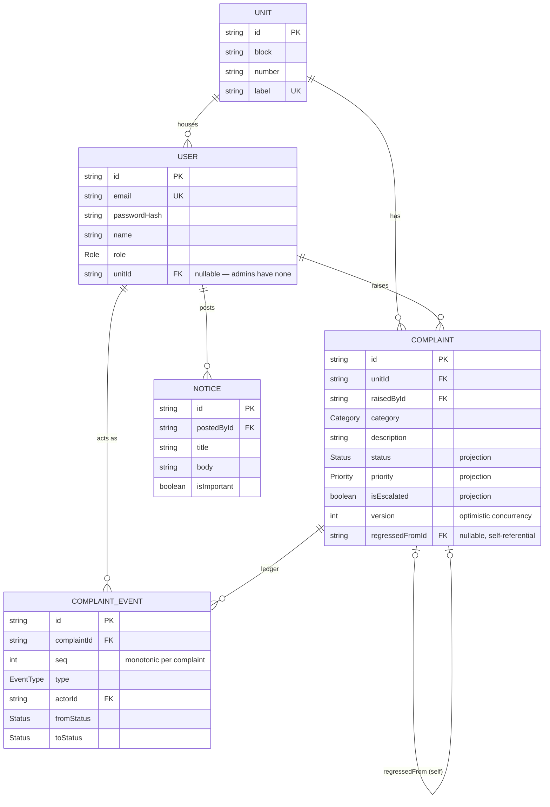

# CommunityDesk

CommunityDesk is a complaint and maintenance tracker for apartment societies. Residents raise
complaints — with an optional photo — against their unit; admins triage them through a
status/priority lifecycle, watch SLA compliance, spot recurring problems, and keep residents
informed via a notice board and email.

Overdue is detected automatically, evaluated against the SLA matrix (category × priority,
admin-editable at `/admin/settings`) — no one has to notice or mark anything. Escalation is a
separate, manual flag an admin sets by hand. Both are distinct signals and both surface at the
top of the admin queue, with their own badges.

It's a single Next.js application: no separate backend, no microservices, no real-time layer.
The full set of behavioral guarantees (why status can only change one way, why "overdue" is
never stored, why authorization lives in the data layer) is documented in
[`ARCHITECTURE.md`](./ARCHITECTURE.md) — read that first if you're changing how the system
behaves, not just what it looks like.

---

## Live URL

**https://communitydesk-rosy.vercel.app/**

**Demo credentials** (seeded, password is the same for every account):

| Role     | Email                          | Password       |
|----------|---------------------------------|----------------|
| Admin    | `admin@societytracker.test`     | `Password123!` |
| Resident | `aarav.sharma@example.com`      | `Password123!` |

The admin account has no unit and sees `/admin/*`. The resident account belongs to unit
**A-101** and sees `/resident/*`. Every other seeded resident (see `prisma/seed.ts`) uses the
same password.

---

## Tech stack

| Concern            | Choice                                              |
|---------------------|------------------------------------------------------|
| Framework           | Next.js 14 (App Router), TypeScript (strict)         |
| Database             | PostgreSQL (Neon), via Prisma                        |
| Auth                 | NextAuth, credentials provider, JWT sessions          |
| Validation           | Zod, at every API boundary                            |
| Photo storage         | Cloudinary, signed direct-to-cloud upload             |
| Email                 | Nodemailer over SMTP, sent by a pollable drain worker |
| Styling               | Tailwind CSS, no component library                    |
| Tests                 | Vitest                                                |

---

## Local setup

You'll need Node 18.17+ and a Postgres database (a free [Neon](https://neon.tech) project is
the fastest path — it gives you both the pooled and direct connection strings the app needs).
Ten-minute path:

```bash
# 1. Clone and enter the repo
git clone https://github.com/ayushchauhan1204/society-maintenance-tracker.git
cd society-maintenance-tracker

# 2. Install dependencies
npm install

# 3. Configure environment variables
cp .env.example .env
# then fill in every value in .env — see the comment above each one for
# where to get it. At minimum you need DATABASE_URL/DIRECT_URL (Neon),
# NEXTAUTH_SECRET (openssl rand -base64 32), and NEXTAUTH_URL
# (http://localhost:3000). Cloudinary/SMTP can be real free-tier accounts;
# without them, photo upload and the email drain worker will fail at the
# point they're used, but everything else works.

# 4. Create the database schema
npx prisma generate
npx prisma migrate deploy

# 5. Seed realistic demo data (units, residents, an admin, SLA policies,
#    ~30 complaints with full event histories, notices — all idempotent,
#    safe to re-run)
npm run db:seed

# 6. Run it
npm run dev
```

Open `http://localhost:3000` — you'll be redirected to `/login`. Sign in with the demo
credentials above, or register a new resident account (residents pick their unit from a
dropdown of the seeded units; admins are seeded only, never self-registered).

---

## API documentation

All routes live under `/api`. Every mutating route validates its body with Zod before touching
anything else; a `400` with an `issues` field means validation failed. Every route that requires
a session returns `401` with no session and `403` with the wrong role. Response bodies below show
the shape you get back, not literal example values, unless noted.

### Conventions

- **Auth** column: `Public`, `Resident`, `Admin`, or `Any` (either role, just needs a session).
- Timestamps are ISO 8601 UTC strings in JSON.
- A `Complaint` object (unless a route says otherwise) is the full row: `id, unitId, raisedById,
  category, description, photoPublicId, photoUrl, status, priority, isEscalated, lastActivityAt,
  resolvedAt, version, regressedFromId, createdAt`.
- `version` is required on every mutating complaint action, per the optimistic-concurrency
  invariant — send back the `version` you last read. A stale value gets a `409`.

### Auth

NextAuth (v4) owns this group under `/api/auth/*`; only the credentials flow is wired up (no
OAuth providers). The routes you'll actually call:

| Method | Path | Auth | Request | Response |
|---|---|---|---|---|
| GET | `/api/auth/csrf` | Public | — | `{ csrfToken: string }` — fetch this first |
| POST | `/api/auth/callback/credentials` | Public | form-encoded: `email, password, csrfToken, json=true` | Sets a session cookie; `{ url }` on success, redirects to sign-in with `?error=` on failure |
| GET | `/api/auth/session` | Any | — | `{ user: { id, name, email, role, unitId } } \| {}` |
| POST | `/api/auth/signout` | Any | form-encoded: `csrfToken` | Clears the session cookie |
| POST | `/api/auth/register` | Public | `{ name, email, password, unitId }` — `password` min 8 chars, `unitId` must be an existing unit | `201 { id, email }`; `409` if email taken, `400` if the unit doesn't exist |

Registration is resident-only by construction — there's no `role` field to set. Admins are
seeded (`prisma/seed.ts`), never created through this endpoint.

### Units

| Method | Path | Auth | Request | Response |
|---|---|---|---|---|
| GET | `/api/units` | Public | — | `[{ id, label }]` — powers the registration dropdown; no complaint/resident data leaks through it |

### Resident complaints

| Method | Path | Auth | Request | Response |
|---|---|---|---|---|
| GET | `/api/complaints` | Resident | — | `[Complaint & { isOverdue: boolean }]` — only complaints raised by the caller |
| POST | `/api/complaints` | Resident | `{ category, description, photoPublicId?, photoUrl? }` — `description` 10–2000 chars; the two photo fields must both be present or both absent, and `photoUrl` must be a `res.cloudinary.com` URL | `201 Complaint & { unit: Unit }` |
| GET | `/api/complaints/:id` | Resident | — | `Complaint & { isOverdue, events: Event[], regressedFrom: {id, category, createdAt} \| null }`; `404` if the complaint isn't yours — **not** a `403`, the row is simply never in the query's universe |

`Event` = `{ id, seq, type, actorId, actor: { name }, fromStatus, toStatus, fromPriority,
toPriority, note, createdAt }`.

### Photo upload

| Method | Path | Auth | Request | Response |
|---|---|---|---|---|
| POST | `/api/uploads/sign` | Resident | `{ mimeType, sizeBytes }` — `mimeType` one of `image/jpeg, image/png, image/webp, image/gif`; `sizeBytes` ≤ 5MB | `{ cloudName, apiKey, timestamp, signature, folder, allowedFormats }` |

This route never touches image bytes — it validates the *declared* type/size and signs a
Cloudinary upload. The browser then `POST`s the file straight to
`https://api.cloudinary.com/v1_1/{cloudName}/image/upload` with those fields (plus `file`), and
only the resulting `public_id`/`secure_url` are sent back to `POST /api/complaints`.

### Admin complaint queue

| Method | Path | Auth | Request | Response |
|---|---|---|---|---|
| GET | `/api/admin/complaints` | Admin | query params, all optional: `category, status, from, to` (dates as `YYYY-MM-DD`) | `[AdminQueueRow]` — see below |
| GET | `/api/admin/complaints/:id` | Admin | — | `Complaint & { unit: {label}, raisedBy: {name, email}, isOverdue, events: Event[], regressedFrom, legalNextStatuses: Status[] }`; `404` if the id doesn't exist |
| POST | `/api/admin/complaints/:id/actions` | Admin | see below | Updated `Complaint`; `404/409/422` on failure — see below |

`AdminQueueRow` = `{ id, category, description, status, priority, isEscalated, createdAt,
lastActivityAt, version, regressedFromId, unitLabel, residentName, residentEmail, slaHours,
hoursOpen, isOverdue }`. It's produced by a raw SQL query joining the SLA matrix, sorted
overdue-first, then escalated, then priority, then oldest — filters narrow the `WHERE` but never
touch that ordering.

**Actions** — the body is a discriminated union on `kind`, and `expectedVersion` is always
required:

```jsonc
{ "kind": "STATUS_CHANGE",   "toStatus": "IN_PROGRESS" | "RESOLVED", "note"?: string, "expectedVersion": number }
{ "kind": "PRIORITY_CHANGE", "toPriority": "LOW" | "MEDIUM" | "HIGH", "note"?: string, "expectedVersion": number }
{ "kind": "ESCALATE",        "note"?: string, "expectedVersion": number }
{ "kind": "DEESCALATE",      "note"?: string, "expectedVersion": number }
{ "kind": "NOTE",            "note": string,  "expectedVersion": number }
```

Failure modes: `404` if the complaint doesn't exist, `422` with a message if the transition is
illegal (e.g. `RESOLVED → IN_PROGRESS`, or anything but `NOTE` on a resolved complaint), `409`
with `{ error, currentState: Complaint }` if `expectedVersion` is stale — the client is expected
to show "someone else updated this, refresh" and re-fetch, never to retry blindly.

### Notices

| Method | Path | Auth | Request | Response |
|---|---|---|---|---|
| GET | `/api/notices` | Any | — | `[Notice & { postedBy: {name} }]`, important ones first, then newest first |
| POST | `/api/admin/notices` | Admin | `{ title, body, isImportant? }` — `title` 3–200 chars, `body` 10–5000 chars | `201 Notice` |

Posting an important notice enqueues one `IMPORTANT_NOTICE` outbox row per resident, in the same
transaction as the notice itself.

### Outbox / email

| Method | Path | Auth | Request | Response |
|---|---|---|---|---|
| POST | `/api/admin/outbox/drain` | Admin | — | `{ sent, retried, failed }` |

Claims up to 25 `PENDING` messages whose `nextAttemptAt` has passed and sends each one over SMTP,
committing that message's own outcome (`SENT`, rescheduled with backoff, or `FAILED` after 5
attempts) independently of the others — one bad send never rolls back a good one. No route ever
sends mail inline from a state-changing request; this is the only route that sends anything.
Status changes and important notices already nudge it to run in the background on their own (see
`lib/outbox/nudge.ts`); the "Send pending emails" button on `/admin/system` is the same route
triggered by hand, for a manual catch-up without a cron job.

**A note on email in this deployment**: both the live demo and local dev use Mailtrap's free
sandbox tier — it captures every message in a private testing inbox rather than delivering to
real addresses, and caps at 50 messages/month. `/admin/system` shows the real outbox state
regardless — sent, pending, and failed, with the literal provider error text — so you can see
what actually happened even without Mailtrap access.

---

## Database schema



`SlaPolicy`, `OutboxMessage`, and `Setting` are deliberately **not** in that diagram — none of
them has a real foreign key to `Complaint`:

- **`SlaPolicy`** (`category, priority → hours`) is matched against a complaint by *value*, not
  by a stored relation. That's what lets an admin edit the SLA matrix and have every open
  complaint's overdue status change instantly, with no backfill — there's nothing pointing at a
  specific policy row to update.
- **`OutboxMessage`** carries a free-form JSON `payload` (which may *mention* a `complaintId`)
  instead of a foreign key, so a complaint can be deleted, and the outbox worker's job — sending
  mail, never touching complaint state — stays completely decoupled from complaint lifecycle
  concerns.
- **`Setting`** is a flat key/value table (`recurrence_window_days`,
  `recurrence_threshold_count`) with nothing to relate to.

### Why the ledger and the projection are separate tables

A complaint's `status`, `priority`, `isEscalated`, and `lastActivityAt` live directly on the
`Complaint` row — that's the **projection**: cheap to read, cheap to sort and filter on, what
every list view queries. But none of those columns is ever written directly. Every meaningful
change — a status transition, a priority bump, an escalation, a note — first appends a row to
`ComplaintEvent`, an append-only ledger with a monotonic `seq` per complaint. The projection
update happens in the *same* database transaction as that append (see `applyTransition()` in
`lib/complaints/transition.ts`), gated on `version` so two concurrent writers can't silently
clobber each other.

The reason to keep them as two tables instead of just mutating `Complaint` in place: the
projection can be **wrong and recoverable**, but the ledger can't be. If a bug ever miscomputes
`status`, the fix is to replay `ComplaintEvent` and rebuild the projection — the history that
actually happened is still there, untouched. A single mutable row has no such recovery path, and
it can't answer "what happened, in what order, and who did it," which is exactly what the
resident- and admin-facing timeline views need to render. The ledger is the source of truth; the
projection is a cache with an invalidation strategy of "recompute in the same transaction that
invalidated it."

Two derived concepts follow directly from this: **overdue** (`status != RESOLVED AND age >
slaPolicy.hours`) and **recurrence**/**regression** (repeat complaints for the same
`(unit, category)` within a rolling window) are both computed at *read* time from `Complaint` +
`SlaPolicy`/`Setting`, never stored as columns. Nothing needs to notice that time has passed and
go update a row — reading the data correctly *is* the update.

---

## Testing

```bash
npx vitest run
```

**Coverage**: `tests/transition.test.ts` is the suite for the two hard-invariant-bearing
functions, `applyTransition()` and `isOverdue()`:

- Every legal transition (`OPEN → IN_PROGRESS`, `OPEN → RESOLVED`, `IN_PROGRESS → RESOLVED`)
  succeeds and sets `resolvedAt` correctly; every illegal one (backward, sideways, anything but
  `NOTE` once `RESOLVED`) throws `IllegalTransitionError` and leaves no trace — no event, no
  projection change.
- The event ledger's `seq` increments monotonically across mixed event types
  (status/priority/escalation/note), and `version` increments on every write.
- A stale `expectedVersion` throws `ConcurrencyError` carrying the real current state, with zero
  partial writes.
- A status change enqueues exactly one outbox row; every other event kind enqueues none.
- The overdue boundary is exact: not overdue at precisely the SLA threshold, overdue one second
  past it; never overdue once `RESOLVED`, regardless of age.

Everything built after that phase — the admin queue's raw-SQL overdue join, notices, photo
upload, the outbox drain worker, the dashboard aggregates, and recurrence detection — was
verified by hand against a running instance and the real seed data (registering/logging in as
each role, exercising every API route, checking response shapes and status codes, confirming the
numbers a dashboard aggregate reports match a direct database query) rather than by an automated
suite. See **Known limitations** below.

---

## Known limitations and deferred work

- **Automated test coverage stops at the transition engine.** The admin queue, notices, uploads,
  outbox drain, dashboard, and recurrence detection are all hand-verified, not covered by
  `tests/`. Adding integration tests for those routes would be the highest-value next step.
- **The outbox drain worker isn't safe under true concurrency.** It's a manually-triggered,
  single-request batch processor — there's no `CLAIMED` state, so two admins clicking "Send
  pending emails" at the same instant could both pick up the same message. Fine for a
  manually-demoed worker; not fine as a real cron job without adding row-level claiming.
- **No pagination.** The resident list, admin queue, and notice board all load everything in one
  query. Acceptable at seed-data scale (~30 complaints); would need cursor-based pagination at
  real-society scale.
- **Cloudinary validation is declaration-based.** The signing endpoint checks the *declared*
  `mimeType`/`sizeBytes` before issuing a signature, and Cloudinary's `allowed_formats` rejects
  wrong file types server-side on upload — but nothing re-verifies the uploaded asset's actual
  dimensions or content after the fact.
